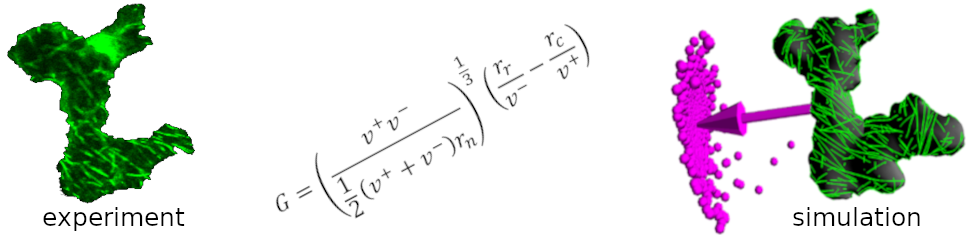

.. CorticalSim 3D documentation master file, created by
   sphinx-quickstart on Tue Mar 17 14:38:49 2026.
   You can adapt this file completely to your liking, but it should at least
   contain the root `toctree` directive.

CorticalSim 3D documentation
============================

Add your content using ``reStructuredText`` syntax. See the
`reStructuredText <https://www.sphinx-doc.org/en/master/usage/restructuredtext/index.html>`_
documentation for details.

.. toctree::
   :maxdepth: 2
   :caption: Contents:

   introduction.md
   breathe.md

